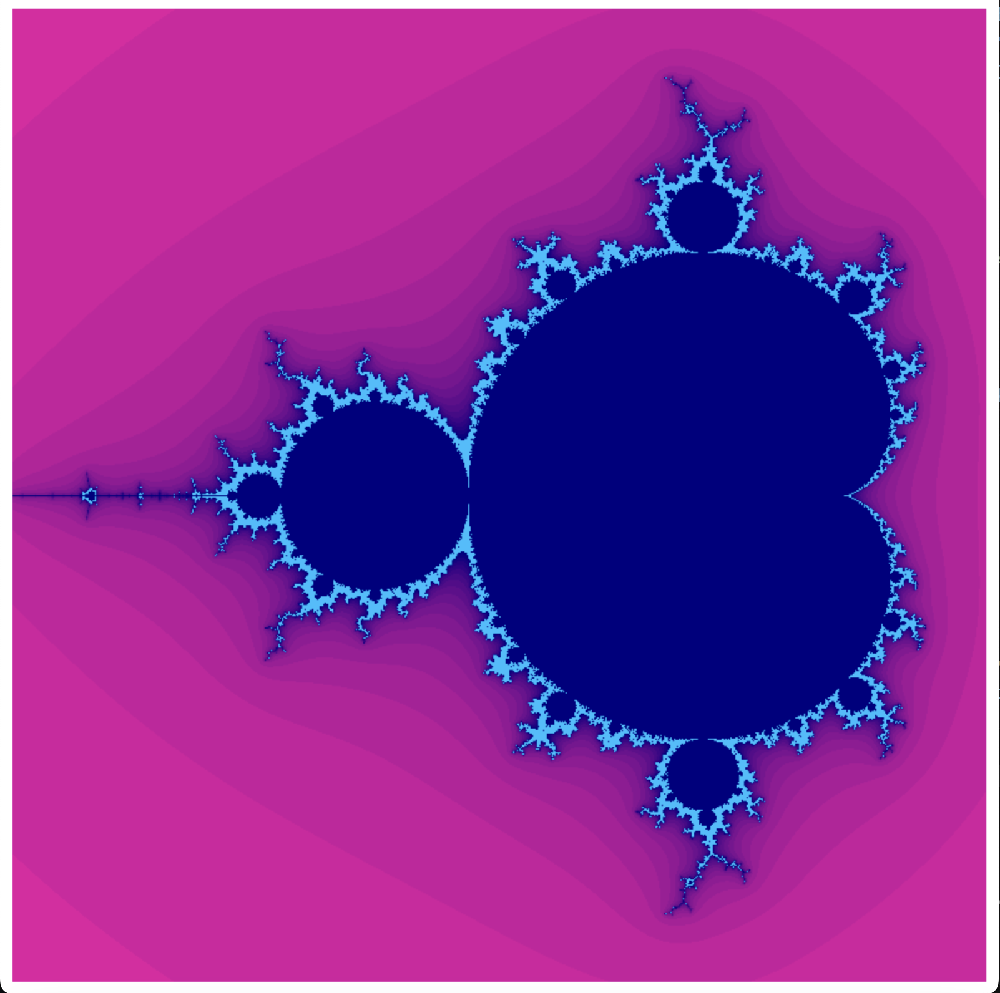
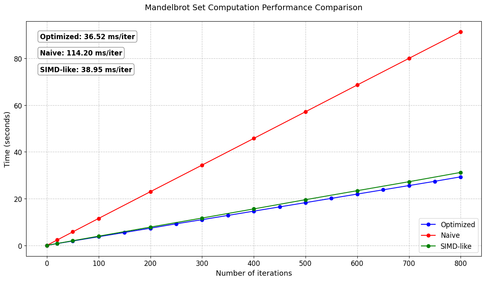

# Mandelbrot Set Optimization Analysis

This repository contains three implementations of Mandelbrot set generation with different optimization levels: Naive implementation, SIMD-like optimization, ARM NEON Intrinsics implementation



The **Mandelbrot set** is a famous fractal defined as the set of complex numbers \( c \) for which the iterative sequence:

`zₙ₊₁ = zₙ² + c` (where `z₀ = 0`)

does not diverge to infinity. When visualized, it produces intricate, infinitely detailed fractal patterns.

## Computational Complexity

Generating the Mandelbrot set is computationally expensive because:

- Each pixel requires dozens to hundreds of complex-number iterations.
- The algorithm must check whether \( |z_n| < 2 \) (escape condition) in every iteration.
- The color of a pixel depends on how quickly the sequence escapes (if it does).

## Architecture and Requirements

### Supported Architectures

| Version             | Target Architecture | Instruction Set        |
|---------------------|---------------------|------------------------|
| Scalar (naive)      | x86, ARM            | None (portable)        |
| SIMD (opt4 / opt44) | ARM64               | NEON SIMD Intrinsics   |

> **Note:** Optimized versions require an **ARM64 processor with NEON SIMD support**.

### Dependencies

- **SDL2** (for graphical rendering)

---

## Building the Project

Three build targets are available:

```bash
make naive      # Scalar (naive) implementation
make opt4       # SIMD-like implementation
make opt44      # ARM NEON Intrinsics implementation
```

Executables will be located in the `./build/` directory.

### Example

```bash
./build/opt44
```

## Command-Line Options

The application supports the following command-line flags:

| Short Flag | Long Flag        | Description                             | Argument |
|------------|------------------|-----------------------------------------|----------|
| `-g`       | `--graphics`     | Enable graphical rendering (SDL2)       | No       |
| `-ng`      | `--no-graphics`  | Disable graphics (console mode)         | No       |
| `-r <N>`   | `--runs=<N>`     | Number of benchmark runs                | Yes      |
| `-h`       | `--help`         | Display help information                | No       |

### Example

```bash
./build/opt44 --runs= 1000 --no-graphics
```

# Performance Analysis

The implementation shows linear scaling with iteration count:



Average time per iteration(naive): 114.20 ms
Average time per iteration(optimized): 36.52 ms

The NEON-optimized version demonstrates a 3.12x speedup over the naive scalar implementation.


